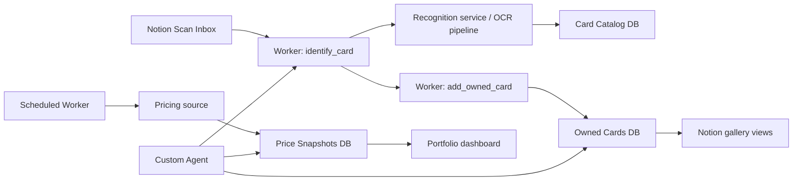

# Grand Line Vault
## Product Specification

**Project type:** Notion hackathon build  
**Product:** A Notion-native One Piece Card Game collection manager  
**Working title:** Grand Line Vault  
**Primary audience:** One Piece TCG collectors who want a beautiful, queryable, multi-user collection inside Notion  
**Core promise:** Scan a card once, and your collection becomes organized, searchable, and financially legible.

---

## 1. Product Vision

Grand Line Vault turns a Notion workspace into a living One Piece card collection.

Users scan an English One Piece card, the system identifies it, enriches it with canonical card data, estimates likely raw condition / PSA-style grade range when possible, and adds it to the collector’s Notion database. From there, collectors can browse cards visually, track set completion, build wishlists, monitor portfolio value, and ask natural-language questions about their collection through a Notion Agent.

The product should feel like a vault, not a spreadsheet:

- visually rich
- frictionless to add to
- useful for serious collectors
- social enough for friends to share one workspace without mixing up ownership

---

## 2. Why This Product

Collectors usually split their workflow across:

- physical binders
- marketplace tabs
- price trackers
- spreadsheets
- memory

Grand Line Vault collapses that into one Notion-native experience:

```text
scan → recognize → enrich → store → explore → act
```

The product wins if it makes the first 30 seconds magical and the next 30 days useful.

---

## 3. Target Users

### Primary user
**Solo collector**
- owns cards across multiple sets
- wants to know what they have, what they are missing, and what it is worth
- values visual browsing and quick search

### Secondary user
**Collector group / friend workspace**
- multiple collectors sharing one Notion workspace
- each person wants their own collection while still being able to compare, trade, and browse together

### Tertiary user
**Completionist / investor**
- tracks set completion, duplicates, value trends, and target acquisitions

---

## 4. Product Principles

1. **Notion first**  
   The user interface should be Notion pages, databases, views, charts, and agents—not a separate web app wearing Notion as storage.

2. **Fast capture beats perfect capture**  
   A scan should create a useful record quickly, then allow refinement.

3. **Canonical data and owned copies are separate**  
   A card definition is not the same thing as a user’s physical copy of that card.

4. **Only English cards in scope**  
   The MVP should reject or flag non-English cards rather than letting the collection become ambiguous.

5. **Trust over theatrics**  
   The grading feature should be framed as a rough pre-grade estimate, never an official PSA grade.

---

## 5. Core User Journey

### Happy path

1. User opens the **Scan Inbox** page in Notion.
2. User uploads a front image of an English One Piece card.
3. A Notion Worker sends the image to a card recognition service or recognition pipeline.
4. The system identifies the card and confirms that it is English.
5. The Worker fetches canonical card metadata:
   - card ID
   - name
   - set
   - rarity
   - color
   - type
   - text / effect
   - official or reference image
   - market price if available
6. The system creates or reuses the canonical **Card Catalog** record.
7. The system creates an **Owned Card** record for that user.
8. The user sees a beautiful Notion card page and can browse it in gallery views.
9. The user can ask the Agent:
   - “What cards am I missing from OP-05?”
   - “Show me my highest-value cards.”
   - “Which duplicates do I own?”
   - “What changed most in my portfolio this week?”

### Enhanced path

If the user also uploads front and back images:

1. The system inspects:
   - centering
   - corners
   - edges
   - surface cues
2. It returns a rough pre-grade estimate such as:
   - “Likely PSA 8–9 range”
   - “Centering looks strong; lower confidence due to glare”
3. The estimate is stored with the owned copy, not the canonical card.

---

## 6. MVP Scope

### P0 — Must Have for Hackathon Demo

### Capture and recognition
- Upload card image from a Notion page
- Identify English One Piece card
- Reject or flag non-English cards
- Support cards from OP-01 through OP-15
- Create card record automatically

### Data enrichment
- Fetch card metadata from a One Piece card data source
- Store canonical card details
- Attach card image

### Collection management
- Add owned card to a user-specific collection
- Support multiple users / owners in one workspace
- Track quantity
- Track condition notes

### Notion experience
- Visual gallery of collection
- Table view for power users
- Set views
- Owner-specific filtered views
- Card detail pages

### Agent capabilities
- Answer collection questions
- Lookup a card
- Add a recognized card to collection
- Show missing cards by set
- Show duplicates

### Demo-ready analytics
- Total collection size
- Set completion
- Collection by rarity
- Estimated portfolio value

---

### P1 — Strong Follow-Up Features

- Wishlists
- Duplicate / trade candidates
- Portfolio history
- Price snapshots over time
- “Recently added” feed
- Favorite characters / crews
- Set completion dashboard
- Better confidence handling for recognition
- Batch import from multiple scans

---

### P2 — Stretch / Nice to Have

- Buying flow via marketplace links
- “Recommended next card” suggestions
- Target-price alerts
- Trade matching across friends
- Deck-building adjacency
- Gamification:
  - bounty board
  - crew rank
  - set completion badges

---

## 7. Non-Goals for MVP

- Full marketplace checkout
- Official grading or PSA certification replacement
- Japanese / Chinese / multilingual card support
- Deck simulator
- Mobile app outside Notion
- High-frequency intraday trading dashboard

---

## 8. Functional Requirements

### 8.1 Scan Inbox

**Purpose:** Entry point for card capture.

**Required fields**
- uploaded image
- submitted by
- status
- recognition result
- confidence
- linked owned card
- error state

**Statuses**
- New
- Processing
- Matched
- Needs Review
- Rejected

---

### 8.2 Card Recognition

**Inputs**
- card image
- optional owner
- optional front/back image pair

**Outputs**
- recognized card ID
- likely card name
- language
- confidence score
- candidate matches if ambiguous

**Rules**
- only English cards may pass automatically
- if confidence is below threshold, mark **Needs Review**
- if language is non-English or uncertain, mark **Rejected** or **Needs Review**

---

### 8.3 Card Catalog

**Purpose:** Canonical source of truth for card definitions.

**Fields**
- Card ID
- Name
- Set
- Variant
- Rarity
- Color
- Card Type
- Cost
- Power
- Counter
- Effect Text
- Image
- English Available
- Source URL / source ID

**Rules**
- one canonical record per unique English card variant
- never duplicate this record per user

---

### 8.4 Owned Cards

**Purpose:** Represents a physical card copy owned by a user.

**Fields**
- Owner
- Card relation
- Quantity
- Acquisition date
- Acquisition price
- Condition
- Raw / graded status
- Pre-grade estimate
- Notes
- Scan image(s)
- Current estimated value

**Rules**
- multiple owned copies may point to the same canonical card
- pre-grade estimate belongs here, not in Card Catalog

---

### 8.5 Wishlists

**Fields**
- Owner
- Card relation
- Priority
- Target price
- Reason
- Status

---

### 8.6 Price Snapshots

**Fields**
- Card relation
- Timestamp
- Market price
- Low price
- Source

**Rules**
- historical values should be stored rather than overwritten
- portfolio charts should derive from snapshots

---

### 8.7 Agent Commands

Examples:

- “Add this scanned card to Spencer’s collection.”
- “Show all my OP-01 leaders.”
- “What English cards am I missing from OP-07?”
- “Which cards in my collection increased most this month?”
- “What duplicates could I trade?”
- “Create a wishlist from the missing secret rares in OP-05.”

---

## 9. Suggested Notion Workspace Structure

```text
Grand Line Vault
├── Scan Inbox
├── My Collection
│   ├── Gallery View
│   ├── By Set
│   ├── By Rarity
│   └── Duplicates
├── Card Catalog
├── Wishlists
├── Portfolio Dashboard
├── Crew Collections
└── Admin / Data Health
```

### Recommended database views

**Owned Cards**
- Gallery by owner
- Table by set
- Board by rarity
- Filtered “Duplicates”

**Card Catalog**
- All cards
- By set
- Missing from my collection

**Portfolio Dashboard**
- total value over time
- value by set
- value by rarity
- top movers

---

## 10. Technical Architecture



### Worker capabilities

#### Tools
- `identify_card`
- `add_owned_card`
- `lookup_card`
- `collection_query`
- `wishlist_create`

#### Syncs
- `sync_card_catalog`
- `sync_price_snapshots`

#### Optional webhooks
- external ingestion endpoint if scans are submitted from outside Notion later

---

## 11. External Services / Data Sources

### Card recognition
Preferred options:
1. dedicated card recognition API
2. image + OCR + database matching fallback

### Card data
Use:
- official English One Piece card list as a trusted reference
- third-party card API for structured retrieval if needed

### Pricing
Use:
- third-party market data API
- snapshot prices nightly or on a reasonable schedule

### Important implementation note
Do not make the UI depend directly on a third-party service being live in the moment. Cache card metadata and store price history locally in Notion databases.

---

## 12. Grading / Condition Strategy

### Product language
Use:
- “Pre-grade estimate”
- “Likely range”
- “Condition signal”

Avoid:
- “PSA grade”
- “Official grade”
- anything implying certification

### Inputs
- front photo required
- back photo strongly recommended
- better estimate when both are present

### Estimation dimensions
- centering
- corners
- edges
- surface
- confidence level

### Example output

```text
Likely range: PSA 8–9
Confidence: Medium
Reasoning: Strong front centering, slight whitening on two rear corners, glare limits surface assessment.
```

---

## 13. Data Quality and Edge Cases

### Must handle
- alternate arts
- promo cards
- reprints
- duplicate card names
- same character across many sets
- low-confidence image matches
- non-English cards
- glare / sleeve / bad lighting

### Review queue
Any scan with:
- ambiguous variant
- low confidence
- uncertain language
- poor image quality

should land in **Needs Review** instead of silently polluting the collection.

---

## 14. Multi-User Model

Each owned card must have an **Owner** property.

This allows:
- one shared workspace
- separate personal collections
- combined crew analytics
- friend comparison
- future trade matching

Recommended views:
- My Collection
- Crew Collection
- Spencer only
- Friend A only
- Shared wishlist

---

## 15. Analytics and Visualizations

### MVP visuals
- collection gallery
- set completion by percentage
- total portfolio value
- cards by rarity

### Later visuals
- portfolio value over time
- value by owner
- value by set
- price movers
- wishlist gap value

---

## 16. Demo Script

### Goal
Show the product, not a pile of features.

### Suggested sequence
1. Open Grand Line Vault home page
2. Drop in a card image
3. Watch the card appear in the collection
4. Open the generated card page
5. Ask the Agent:
   - “What am I missing from OP-05?”
6. Open portfolio dashboard
7. Show wishlist recommendation or duplicate trade opportunity

### Judge takeaway
“Notion is not merely storing this collection. It is the product.”

---

## 17. Success Metrics

### Hackathon success
- card scan to collection creation in under 30 seconds
- strong visual demo
- natural-language query works live
- at least one meaningful dashboard

### Product success
- card recognition accuracy
- time to add a card
- percentage of scans resolved without manual review
- collection query usage
- repeat usage after first session

### MVP acceptance criteria
- a user can submit a card image and get a matched English card record
- a matched scan creates or updates the canonical card entry and adds an owned copy
- a user can view their collection visually inside Notion
- ownership remains separate across multiple users
- an Agent can answer at least three useful collection questions live
- the dashboard shows at least one portfolio or completion visualization

---

## 18. Risks and Mitigations

### Risk: card recognition mismatch
**Mitigation:** confidence threshold, candidate matches, review queue

### Risk: variants are confused
**Mitigation:** store variant explicitly and show manual confirmation when uncertain

### Risk: grading estimate overpromises
**Mitigation:** frame as pre-grade estimate with confidence level

### Risk: third-party API instability
**Mitigation:** cache metadata, snapshot prices, use official sources where possible

### Risk: too much scope for hackathon
**Mitigation:** keep P0 sacred; P1 only if demo loop is already excellent

---

## 19. Open Questions

1. For the demo, do we want scans to begin from:
   - a Notion file upload
   - a mobile shortcut / form
   - or both?
2. Which recognition provider gives the best One Piece variant accuracy quickly enough for the hackathon?
3. Do we want portfolio prices to be:
   - raw market price only
   - or condition-adjusted estimates too?
4. Should wishlists optimize for:
   - set completion
   - favorite characters
   - value opportunity
   - or all three?
5. What is the one “wow” social mechanic worth keeping in scope:
   - trade matching
   - crew dashboard
   - shared wishlist

---

## 20. Recommended Build Order

### Phase 1 — Foundation
- create Notion databases
- define schemas
- seed card catalog
- create worker skeleton

### Phase 2 — Magic loop
- implement scan intake
- identify card
- add owned card
- generate views

### Phase 3 — Intelligence
- agent tools
- missing-card queries
- duplicates
- wishlist generation

### Phase 4 — Delight
- charts
- portfolio
- recommendations
- polish

---

## 21. Current Source Notes

These are the live external references used to shape the spec as of **May 16, 2026**:

- Notion Workers overview: https://developers.notion.com/workers/get-started/overview
- Writing Agent tools for Notion Workers: https://developers.notion.com/workers/guides/tools
- Notion gallery views: https://www.notion.com/help/galleries
- Notion chart views: https://www.notion.com/help/charts
- Official English One Piece card list: https://en.onepiece-cardgame.com/cardlist/
- API TCG overview: https://docs.apitcg.com/
- GiblTCG card recognition API: https://gibltcg.com/docs/api
- PSA grading standards: https://www.psacard.com/gradingstandards/

---

## 22. One-Sentence Pitch

**Grand Line Vault is a Notion-native One Piece card collector that turns a scan into a living collection: organized, searchable, social, and financially aware.**
