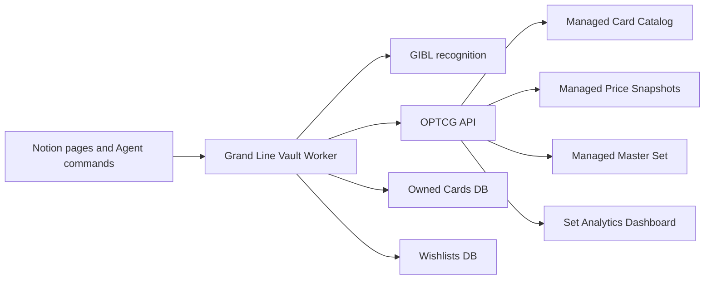

# Grand Line Vault

Grand Line Vault is a Notion-native One Piece Card Game collector built for the Notion hackathon. The product loop is intentionally simple:

```text
scan → recognize English card → enrich from OPTCG API → save owned copy → explore collection
```

Live workspace: [Grand Line Vault in Notion](https://www.notion.so/Grand-Line-Vault-3627be9e126e81bb83ced51cef2628b0)

## Current status

### Done

- Public GitHub repo and deployed Notion Worker.
- Notion command center with embedded collection, scan inbox, wishlist, and master-set views.
- Scan Inbox, Owned Cards, Wishlists, and Master Set databases.
- Gallery, set-completion, owner, duplicate, wishlist, and portfolio-style views in Notion.
- GIBL image-recognition integration for the scan path.
- English-only recognition guardrails.
- OPTCG API card, set, starter-deck, promo, DON!!, price, and image-fetch helpers.
- Offline OP15-EB04 seed data for resilient demos when the live image/card API is unavailable.
- Managed syncs for card catalog, price snapshots, master set, and set analytics.
- Agent tools for lookup, enrichment, collection summaries, duplicate detection, and master-set completion.
- Seed scan test with OP13-118 Monkey.D.Luffy and OP13-119 Portgas.D.Ace.

### Still intentionally open

- The `Owned` checkbox in the Worker-managed Master Set database is read-only from outside the managed sync. The next implementation should compute ownership inside the sync or create a separate completion overlay database keyed by owned cards.
- Scan Inbox automation is wired as a Worker capability, but the full “drop image in Notion page and auto-process without an Agent command” loop still needs the final trigger/polling path.
- Portfolio history currently uses snapshots and collection fields; true gain/loss over time needs recurring price snapshots plus a charting view.
- Buying flow is P2 and should start as marketplace outbound links, not checkout.

## Architecture



## Notion surface

| Area | Purpose |
| --- | --- |
| Grand Line Vault home | Team-facing command center and demo script. |
| Scan Inbox | Drop/review scans before they become owned copies. |
| Owned Cards | Source of truth for collection entries, owners, quantities, price, condition, and card metadata. |
| Wishlists | Chase cards and future recommendation inputs. |
| Master Set | Worker-managed OP set/variant catalog for completion tracking. |
| Set Completion Dashboard | Worker-managed set-level totals and value rollups. |

Note: the Grand Line Vault home page links the workspace together. If a teammate cannot see a database, share the page/database with them from Notion; GitHub visibility does not grant Notion visibility.

## Worker capabilities

### Syncs

- `syncCardCatalog` — generic configurable catalog feed.
- `syncPriceSnapshots` — generic configurable price feed.
- `syncOptcgCardCatalog` — OPTCG-backed OP set catalog.
- `syncOptcgPriceSnapshots` — OPTCG-backed price snapshots.
- `syncOptcgMasterSet` — OP master-set variants and metadata.
- `syncOptcgSetAnalytics` — set-level counts and total market value.

### Agent tools

- `identifyCard`
- `identifyAndEnrichCard`
- `getCardDetails`
- `getSetCards`
- `filterCatalogCards`
- `listAllSets`
- `summarizeMasterSet`
- `classifyRecognitionCandidates`
- `addOwnedCard`
- `summarizeCollection`
- `listDuplicateCards`
- `listStarterDecks`
- `getStarterDeckCards`
- `getStarterCardDetails`
- `filterStarterCards`
- `listAllStarterCards`
- `getPromoCardDetails`
- `filterPromoCards`
- `listDonCards`

## Setup

1. Install Node.js 22+ and npm 10+.
2. Install dependencies:

```bash
npm install
```

3. Copy `.env.example` to `.env`.
4. Configure the required values:

```text
NOTION_API_TOKEN=
OWNED_CARDS_DATA_SOURCE_ID=
WISHLISTS_DATA_SOURCE_ID=
GIBL_API_KEY=
```

5. Optional values:

```text
GIBL_GAME_TYPE=one-piece
CATALOG_FEED_URL=
PRICE_FEED_URL=
OPTCG_SET_IDS=OP-01,OP-02,OP-03,OP-04,OP-05,OP-06,OP-07,EB-01,OP-08,OP-09,OP-10,OP-11,EB-02,OP-12,PRB-01,PRB-02,OP-13,OP14-EB04,EB-03,OP15-EB04
RECOGNITION_CONFIDENCE_THRESHOLD=0.82
```

6. Create/share the Notion databases from [the setup guide](./docs/NOTION_WORKSPACE_SETUP.md).
7. Validate locally:

```bash
npm run typecheck
npm test
npm run build
```

## Repository layout

```text
src/
  config.ts                 Environment configuration
  index.ts                  Worker syncs and Agent tools
  data/                     Offline seed data for demo resilience
  lib/                      Collection, grading, master-set, analytics logic
  notion/                   Notion database read/write helpers and schemas
  providers/                Recognition, generic feeds, and OPTCG API providers
docs/
  NOTION_WORKSPACE_SETUP.md
GRAND_LINE_VAULT_SPEC.md    Product/team spec
CHANGELOG.md                Release notes
```

## Product notes

- Automated grading is a **pre-grade estimate**, not an official PSA grade.
- English-only matching is deliberate for the P0 collection loop.
- Generic catalog/price feeds remain available, but the live One Piece path uses OPTCG API plus GIBL.
- Pokémon TCGdex work is currently in draft PRs and should not be merged into the One Piece hackathon path without an explicit product decision.
