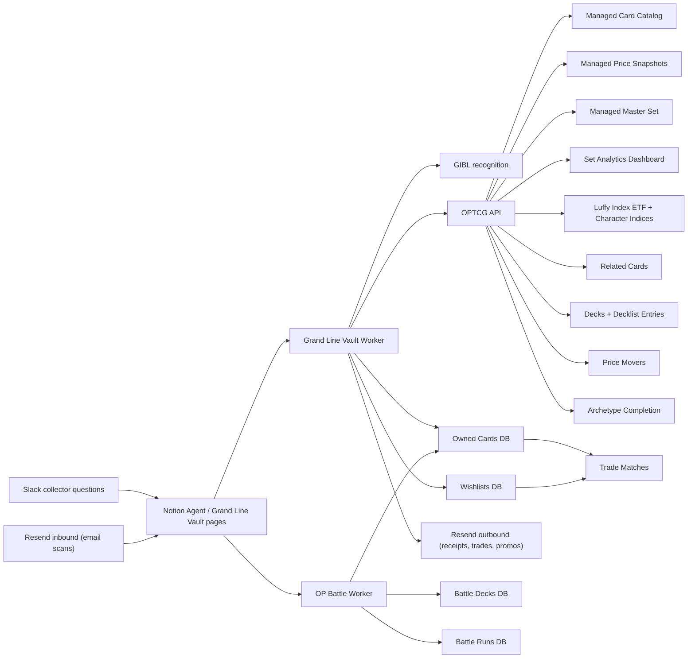

# Grand Line Vault

Grand Line Vault is a Notion-native One Piece Card Game collector built for the Notion hackathon. The product loop is intentionally simple:

```text
scan → recognize English card → enrich from OPTCG API → save owned copy → explore collection
```

Live workspace: [Grand Line Vault in Notion](https://www.notion.so/Grand-Line-Vault-3627be9e126e81bb83ced51cef2628b0)

## Scope

Grand Line Vault is scoped as a **One Piece TCG-first collector workspace** for the Notion hackathon. The demo path stays focused on English One Piece cards:

```text
Scan Inbox image upload or Slack card image → Agent/Worker processes scan → Notion stores the owned card → Slack asks the Agent → Notion answers from the vault
```

The repository now also contains provider libraries for adjacent expansion tracks. These are intentionally secondary:

| Track | Status | Role in the project |
|---|---|---|
| **One Piece TCG / OPTCG** | Core shipped path | Main hackathon demo, Notion databases, scan ingestion, collection management, completion, decks, Luffy Index, related-card recommendations |
| **PriceCharting** | Library merged, not wired into Worker tools yet | Future graded/raw pricing enrichment; requires a paid PriceCharting token and strict 1 request/sec pacing |
| **Pokémon / TCGdex** | Library merged, not wired into Notion workspace yet | Future multi-game vault expansion; isolated under `src/providers/tcgdex/` so it does not pollute the One Piece data model |
| **PSA verification** | Provider scaffolds merged; awaiting authenticated docs access to fill in real endpoints | Cert verification, population report, auction prices, price guide, card facts, OAuth 2 password-grant — types and signatures in place; bodies throw not-implemented until the gated PSA docs are accessed and the real endpoint URLs are dropped in |

For judging, present the project as **a Notion-native One Piece card vault with Slack as the conversational front door**. Optional provider rails support broader TCG coverage later, but the judged path is the One Piece collector loop.

## Demo flow

The current hackathon demo uses Slack + Notion together:

```text
1. Collector uploads an English One Piece card image to the Notion Scan Inbox, or sends the card image to Vault Quartermaster from Slack.
2. Vault Quartermaster / Notion Agent processes the latest scan through the Worker.
3. The Worker recognizes the card, enriches it from OPTCG data, and creates or updates an Owned Card row.
4. Collector asks in Slack: “What card did I just scan?” or “Show my OP-01 cards.”
5. Notion Agent answers from the Grand Line Vault Notion workspace and links back to the source data.
6. Collector asks the OP Battle worker to build decks or simulate owner-vs-owner matchups from the same Owned Cards database.
```

Validated Slack examples:

```text
@Notion AI show my OP-01 cards
→ Returns OP-01 owned cards across the crew with owner, quantity, type, color, and market price.

@Notion AI which is the most expensive?
→ Uses the previous OP-01 context and returns Roronoa Zoro (001) Parallel — OP01-001 Parallel — $556.77.
```

Agent behavior rules for the demo:

- Treat Notion as the source of truth. Read from Grand Line Vault databases, not memory.
- Default to the requesting user's cards when the owner is clear; say explicitly when showing all crew cards.
- Prefer clean display IDs like `OP01-001 Parallel` instead of internal IDs like `OP01-001_p1`.
- Include card name, set/card number, rarity or type, color, quantity, owner, market price, and a Notion link when available.
- If scan automation is unavailable, use the manual fallback: upload image, leave status as `New`, then run `processLatestScan` or ask the Agent to process the latest scan.

## Features

### Scan and recognize
Upload a card photo to the Scan Inbox, or send a card image to Vault Quartermaster from Slack. The Worker calls a recognition provider (GIBL), classifies confidence + language, and only auto-matches English cards. Low-confidence and non-English scans land in a review queue rather than polluting the collection. Front-only scans work; front+back enables a richer pre-grade estimate.

### Enrich from OPTCG live data
On a confident match, the Worker pulls canonical card data from the OPTCG API (`getCardDetails`, `getSetCards`, `filterCatalogCards`, plus starter-deck / promo / DON variants) — name, set, rarity, color, type, cost, power, counter, attribute, art, market price. The same library powers offline demo mode using a bundled OP15-EB04 seed.


### Slack image intake
Vault Quartermaster can now process a Slack card image instead of requiring the user to manually upload into Notion first. The `processSlackCardImage` tool downloads the Slack file with `SLACK_BOT_TOKEN`, uploads the image into Scan Inbox through Notion File Uploads, runs the existing GIBL + OPTCG processor, creates the Owned Card row, and returns a Slack-ready reply with the result and Notion links.

There is also a production Slack relay at `api/slack-relay.ts`. Slack Events API calls the relay, the relay handles Slack URL verification and forwards image file payloads to the Notion Worker webhook `slackCardIntake`.

Relay environment variables:

```text
NOTION_SLACK_INTAKE_WEBHOOK_URL=https://www.notion.so/webhooks/worker/...
SLACK_BOT_TOKEN=xoxb-...
SLACK_SIGNING_SECRET=...
```

Slack app setup:

1. Deploy the repo to a serverless host that supports `api/slack-relay.ts` (Vercel is the intended path).
2. In Slack → Event Subscriptions, set Request URL to `https://<your-deploy>/api/slack-relay`.
3. Subscribe bot events: `app_mention` and `file_shared`.
4. OAuth scopes: `files:read`, `chat:write`, `app_mentions:read`, plus `channels:history` / `groups:history` if testing in channels/private channels.
5. Invite the GrandlineVault app to the test channel.

Useful Slack prompts:

```text
@Vault Quartermaster scan this for Spencer
@Vault Quartermaster add this card to Jarren's collection
@Vault Quartermaster process this image for Waffle
```

### Collection management
Each scan creates or updates an Owned Card row tied to the scanning user, with quantity, condition, pre-grade estimate, and acquisition price. Multi-user workspace: each crew member has their own collection while sharing the same canonical Card Catalog. Agent tools `addOwnedCard`, `summarizeCollection`, and `listDuplicateCards` cover the loop.

### Master-set tracking with progress bars
Every printing of every card — base, parallel, alt-art, promo — gets a row in the Master Set database. The Set Completion Dashboard rolls counts and market values per set. Toggle the `Completion %` column to "Show as bar" or "Show as ring" in Notion and every set lights up with a live progress visualization fed by your actual ownership.

### Portfolio and price snapshots
`syncOptcgPriceSnapshots` writes a daily snapshot per owned card. The Owned Cards board surfaces total estimated value, top holdings, and rarity rollups. Daily snapshots are the foundation for "what changed in my portfolio this week" once charting views are wired in.

### Card insights and recommendations
- **Related cards**: scoring engine that suggests the top-N most-related cards for any given card based on character, set, color identity, sub-types, cost curve, and rarity. Lives both as a managed `Related Cards` database (cached, gallery-browseable) and as an on-demand library call.
- **Luffy Index ETF**: a price-weighted index that treats every Monkey D. Luffy printing as a constituent of a fund. Track total fund value, top holdings, set distribution, and concentration risk per printing.
- **Character indices**: same pattern generalized to Zoro, Sanji, Nami, the full Strawhat crew, Yonko, and the Donquixote family. One Notion database with a `Character` select column and per-character filtered views.
- **Archetype completion**: per-sub-type completion % (Straw Hat Crew, Whitebeard Pirates, Marines, Yonko, …) — the orthogonal axis to set completion. Includes a curated dictionary so multi-word sub-types like `Straw Hat Crew` aren't tokenized as `Straw + Hat + Crew`.
- **Price movers**: top gainers and losers over rolling 7-day / 30-day windows computed off the daily `priceSnapshots` history. Surfaces "what just spiked" without any new API calls.
- **Trade matcher**: cross-user join of duplicates ↔ wishlists. Spencer's duplicate Luffy meets Jarren's wishlist Luffy and the system emits a trade suggestion.
- **Server-side name search**: `filterCatalogCards({ cardName: "Zoro", color: "Red", rarity: "SR" })` — the optcgapi `card_name` filter is now wired through every catalog filter route and agent tool, so character + criteria searches don't have to pull the full 3,330-card catalog client-side.
- **Collection summaries**: `summarizeCollection` gives totals, top holdings, color/rarity breakdowns per owner. `summarizeMasterSetCompletion` returns base/parallel/total ownership splits per set.
- **Slack + Agent-friendly**: every dataset is a Notion database, so Vault Quartermaster can answer from Slack or Notion: "what card did I just scan?", "show my OP-01 cards", "which card is most expensive?", "what cards am I missing from OP-05?", and "which duplicates could I trade?"

### Deck building
Two related databases (`Decks` + `Decklist Entries`) plus a validator that checks OPTCG construction rules (1 Leader, 50 main, 10 DON!!, max 4 copies, color identity). Same rows render as a **card list** (table grouped by Slot) and as an **image gallery** in Notion — switch views, the data stays in sync.

### Image galleries
Every card-bearing database stores an image. Owned Card pages now also set the card image as the Notion page cover, so the **My Collection Wall** Gallery view can render like a digital binder instead of a table. A short [recipe](./docs/GALLERY_VIEWS.md) sets up consistent Gallery views across Card Catalog, Master Set, Luffy Index, Decklist Entries, and Owned Cards — including `Image-only Wall`, `My Collection Wall`, `Binder by Set`, and `Trophy Case`.

For the Master Set specifically, the [binder setup guide](./BINDER.md) covers the gallery card-size pairing with the `BINDER_DENSITY` env var (small/medium/large), the three recommended view tabs (Binder / Owned Only / Missing), and the page-cover trick that makes card art fill the gallery cards.

### Pre-grade estimate
When a scan includes both front and back, `estimatePreGrade` returns a likely PSA range (8–9, 9–10, etc.) plus a confidence level based on centering / corners / edges / surface signals. Framed deliberately as **pre-grade**, never an official grade.

### Share collection graphic
Generates a 1200×630 shareable image (Twitter/OG card sized) that shows the collector's Vault at a glance — public Notion link, total card count, portfolio value, and 4–6 favorite cards as a tile strip. Pure SVG, zero dependencies, brandable with custom colors. Drop the SVG into a Notion image block, an iMessage thread, a Discord channel, or rasterize to PNG with `@resvg/resvg-js` for chat clients that prefer it. See [`docs/SHARE_COLLECTION_GRAPHIC.md`](./docs/SHARE_COLLECTION_GRAPHIC.md).

### Multi-provider price intelligence
PriceCharting provider libraries add graded-card market prices (BGS 10, CGC 10, SGC 10) that OPTCG does not publish — useful for comparing "raw vs graded" outcomes on the same card. This is merged as a provider layer only; it is not wired into live Worker tools until a paid PriceCharting token is available.

### Pokémon TCG via TCGdex
A separate, namespaced provider section wraps the open [TCGdex](https://tcgdex.dev/) API for Pokémon cards, sets, series, and reference metadata. This is merged as future multi-game infrastructure, isolated from the One Piece code path and Notion data model.

### PSA grading hooks
Scaffolded provider stubs for PSA Public API integration — Cert Verification, Population Report, Auction Prices, Price Guide, Card Facts, and OAuth 2 password-grant token exchange. PSA's full endpoint reference is gated behind their authenticated docs page, so the stubs throw a clear not-implemented error pointing at the real URL; types and function signatures are in place so callers can wire against them once Spencer has dashboard access.

### Email intake (Resend Inbound)
Collectors can **email** card photos to a configured Resend Inbound address (e.g. `scans@grandlinevault.com`) and the worker turns each delivered email into one or more Scan Inbox rows tied to the sender. Includes Svix-style HMAC signature verification, 5-minute replay protection, and an image-only attachment filter to stop "free PDF upload" mischief.

### Email outbound (Resend Send)
Companion outbound library with three ready-to-use HTML templates: **scan receipt** (matched card + image + Notion link), **trade match** (when a duplicate ↔ wishlist match fires), and **promotional** (new set drops, feature announcements). All templates escape user-controlled fields against HTML injection.

### OP Battle Lab
Separate deployed Worker entry point (`src/op-battle.ts`) for Notion-native battle simulation. It reads the same Owned Cards database, auto-builds permanent legal-ish Battle Deck pages from each owner's full collection, runs Monte Carlo matchups, and writes compact Battle Run history pages. The model is official-rule-informed using Bandai's published rules as the baseline, while clearly marking individual card text as heuristic. The live smoke test created permanent Spencer and Jarren decks plus a battle run where Spencer won 60% over 10 test battles. See [`docs/OP_BATTLE_LAB.md`](./docs/OP_BATTLE_LAB.md).

Useful demo commands:

```text
Build Spencer's strongest battle deck.
Simulate Spencer vs Jarren for 100 battles.
Simulate Waffle vs Spencer using strongest decks.
Show recent battle history.
```

## Templates

The Worker provisions and populates a set of managed Notion databases that each act as a reusable template. Every one has gallery-friendly imagery or progress-bar-ready numeric columns so collectors can browse the way they prefer.

| Template | Database key | Defined in | What it tracks |
|---|---|---|---|
| **Card Catalog** | `cardCatalog` | `src/index.ts` | Canonical English card records — one row per unique variant |
| **Master Set** | `masterSet` | `src/notion/master-set-database.ts` | Every printing (base / parallel / alt-art / promo) per set with `Owned` checkbox |
| **Set Completion Dashboard** | `setAnalytics` | `src/notion/analytics-databases.ts` | Per-set summary with **`Completion %` progress bar**, base/parallel split, total + owned market value |
| **Rarity Breakdown** | `rarityAnalytics` | `src/notion/analytics-databases.ts` | Per-rarity counts and values (template; wire a sync to populate) |
| **Top Cards by Value** | `topCards` | `src/notion/analytics-databases.ts` | Most-valuable cards across the collection (template) |
| **Luffy Index ETF** | `luffyIndex` | `src/notion/luffy-index-database.ts` | Price-weighted index of every Luffy printing with **`Index Weight` progress bar** |
| **Decks** | `decks` | `src/notion/decks-database.ts` | One row per deck — Leader, Format, Status, Card Count, Estimated Value |
| **Decklist Entries** | `decklistEntries` | `src/notion/decklist-entries-database.ts` | Per-(deck, card) rows for the **card list + image gallery** dual view, with quantity and slot |
| **Related Cards** | `relatedCards` | `src/notion/related-cards-database.ts` | One row per (source, recommended) pair with score and colored reason chips |
| **Character Indices** | `characterIndex` | `src/notion/character-index-database.ts` | Multi-character ETF board (Luffy, Zoro, Sanji, Nami, Strawhat, Yonko, Donquixote) with `Index Weight` progress bars |
| **Archetype Completion** | `subTypeCompletion` | `src/notion/sub-type-completion-database.ts` | Per-sub-type completion % (Straw Hat Crew, Whitebeard Pirates, Marines, etc.) with progress bars |
| **Price Movers** | `priceMovers` | `src/notion/price-movers-database.ts` | Daily/weekly gainers and losers diffed from `priceSnapshots` history |
| **Trade Matches** | `tradeMatches` | `src/notion/trade-matches-database.ts` | Cross-user duplicate ↔ wishlist join, with priority and status tracking |
| **Wishlist Insights** | `wishlistInsights` | `src/notion/wishlist-insights-database.ts` | Per-wishlist-card row with price target, current market, dollars/percent below target, and a `Target Hit` checkbox |
| **Wishlist Budget** | `wishlistBudget` | `src/notion/wishlist-insights-database.ts` | Per-owner roll-up of total target spend, current spend, and savings-at-target |
| **Duplicate Cards** | `duplicateCards` | `src/notion/duplicate-cards-database.ts` | Per-owner duplicate copies with Status chip (Keep / Trade / Sell / Gift), tradeable value, and counts |
| **Duplicate Owner Summary** | `duplicateOwnerSummary` | `src/notion/duplicate-cards-database.ts` | Per-owner roll-up of duplicate copies and tradeable value |
| **OPTCG Set Master Wall** | `optcgSetMasterWall` | `src/notion/optcg-set-master-wall-database.ts` | Per-set image wall with color art for owned cards and grayscale for missing — the literal binder wall view |
| **Price Snapshots** | `priceSnapshots` | `src/index.ts` | Time-series price records per card; foundation for portfolio history |
| **Scan Inbox** | user-created | `docs/NOTION_WORKSPACE_SETUP.md` | Upload front/back images, see status, link to the matched owned card |
| **Owned Cards** | user-created | `docs/NOTION_WORKSPACE_SETUP.md` | The per-owner source of truth — quantity, condition, scan, pre-grade, current value |
| **Wishlists** | user-created | `docs/NOTION_WORKSPACE_SETUP.md` | Chase cards with priority and target price |
| **OP Battle · Battle Decks** | `opBattleDecks` | `src/notion/op-battle-databases.ts` | Permanent auto-built decks per owner / strategy |
| **OP Battle · Battle Runs** | `opBattleRuns` | `src/notion/op-battle-databases.ts` | Compact Monte Carlo battle history and matchup results |

### Template guides

- [Binder setup](./BINDER.md) — gallery card size + `BINDER_DENSITY` env var + recommended view tabs (Binder / Owned Only / Missing)
- [OP Battle Lab](./docs/OP_BATTLE_LAB.md) — separate Worker, permanent generated decks, 100-game simulations, compact history
- [Luffy Index ETF](./docs/LUFFY_INDEX_ETF.md) — deep-dive + methodology
- [Character indices](./docs/CHARACTER_INDICES.md) — Zoro / Sanji / Strawhat / Yonko / Donquixote indices on the same library
- [Archetype completion](./docs/SUB_TYPE_COMPLETION.md) — per-sub-type completion % with curated dictionary
- [Price movers](./docs/PRICE_MOVERS.md) — top gainers and losers over a rolling window
- [Trade matcher](./docs/TRADE_MATCHER.md) — duplicate ↔ wishlist join across owners
- [Wishlist insights](./docs/WISHLIST_INSIGHTS.md) — per-wishlist target tracking + budget roll-up
- [Duplicate cards](./docs/DUPLICATE_CARDS.md) — duplicate tracking with Keep / Trade / Sell / Gift dispositions
- [Decklist template](./docs/DECKLIST_TEMPLATE.md) — deck builder with recommended views (card list, image wall, cost curve, by color)
- [Related cards scoring](./docs/RELATED_CARDS.md) — scoring weights + wiring snippet + future enhancements
- [OPTCG Set Master Wall](./docs/OPTCG_SET_MASTER_WALL.md) — color/grayscale binder wall per set
- [Share collection graphic](./docs/SHARE_COLLECTION_GRAPHIC.md) — 1200×630 OG/Twitter card SVG generator
- [Twitter share graphic](./docs/TWITTER_SHARE_GRAPHIC.md) — Twitter-sized share card variant
- [IG share story](./docs/IG_SHARE_STORY.md) — 1080×1920 vertical Instagram story variant
- [Gallery views recipe](./docs/GALLERY_VIEWS.md) — how to flip any card database to image-first browsing
- [Notion workspace setup](./docs/NOTION_WORKSPACE_SETUP.md) — initial provisioning of the user-managed databases

## Current status

### Done

- Public GitHub repo and deployed Notion Workers: the main Grand Line Vault worker plus the separate OP Battle worker.
- Notion command center with embedded collection, scan inbox, wishlist, and master-set views.
- Slack-connected Notion Agent flow: ask Vault Quartermaster questions like `show my OP-01 cards` or `what card did I just scan`, and it answers from the Grand Line Vault Notion data.
- Scan Inbox, Owned Cards, Wishlists, and Master Set databases.
- Gallery, set-completion, owner, duplicate, wishlist, and portfolio-style views in Notion.
- GIBL image-recognition integration for the scan path.
- Slack image intake tool: download Slack image, add it to Scan Inbox, process it, and classify it into Owned Cards.
- Scan Inbox upload path: upload a `Front image`, then run `processLatestScan` for a one-card demo or `processScanInboxQueue` for a batch to recognize/enrich the card and create an owned-card record. The true `processScanInboxUpload` Notion automation is coded but gated until the workspace has Worker automations enabled.
- English-only recognition guardrails.
- OPTCG API card, set, starter-deck, promo, DON!!, price, and image-fetch helpers.
- Offline OP15-EB04 seed data for resilient demos when the live image/card API is unavailable.
- Managed syncs for card catalog, price snapshots, master set, and set analytics (ownership-aware completion %).
- Agent tools for lookup, enrichment, collection summaries, duplicate detection, and master-set completion.
- Decklist template with card-list + image-gallery views and OPTCG validator.
- OP Battle Lab live worker with permanent Battle Deck pages and Battle Run history pages.
- Luffy Index ETF + Character Indices (Zoro/Sanji/Nami/Strawhat/Yonko/Donquixote) with price weighting and concentration analytics.
- Related-cards scoring engine and managed `Related Cards` board.
- Archetype/sub-type completion engine with curated OPTCG dictionary.
- Price movers engine (top gainers/losers over 7d/30d windows) reading the existing `priceSnapshots` time-series.
- Trade matcher engine (duplicate ↔ wishlist join across owners).
- Server-side `cardName` filter wired through every catalog / starter-deck / promo filter route.
- Resend inbound parser + signature verification for email-as-intake.
- Resend outbound helpers with HTML templates for scan receipts, trade matches, and promotional emails.
- PSA Public API scaffolds (cert verification, population, auction prices, price guide, card facts, OAuth 2 password-grant).
- Seed scan test with OP13-118 Monkey.D.Luffy and OP13-119 Portgas.D.Ace.

### Still intentionally open

- True upload-trigger automation is blocked until Notion enables Worker automation capabilities for the workspace. Current fallback: upload image, keep Status = `New`, then run `processScanInboxQueue`.
- Portfolio history currently uses snapshots and collection fields; true gain/loss over time needs recurring price snapshots plus a charting view.
- Buying flow is P2 and should start as marketplace outbound links, not checkout.
- Rarity-breakdown and top-cards analytics templates exist but their syncs are not yet wired.

## Architecture



## Worker capabilities

### Syncs

- `syncCardCatalog` — generic configurable catalog feed.
- `syncPriceSnapshots` — generic configurable price feed.
- `syncOptcgCardCatalog` — OPTCG-backed OP set catalog.
- `syncOptcgPriceSnapshots` — OPTCG-backed price snapshots.
- `syncOptcgMasterSet` — OP master-set variants and metadata.
- `syncOptcgSetAnalytics` — set-level counts and total market value with ownership-aware completion %.

### Automations

- `processScanInboxUpload` — coded and gated behind `ENABLE_NOTION_AUTOMATIONS=1`; use when Worker automations are enabled for the workspace.

### OP Battle worker tools

The battle simulator is deployed as a separate Notion Worker using `workers.op-battle.json`.

- `buildBattleDeck` — auto-builds a permanent legal-ish deck page for an owner from Owned Cards.
- `simulateBattle` — builds both decks, runs a Monte Carlo matchup, and writes a Battle Run history page.
- `archiveBattleRuns` — marks older Battle Run pages as done so the workspace stays compact.

### Agent tools

- `identifyCard`
- `identifyAndEnrichCard`
- `processScanInboxPage`
- `processScanInboxQueue`
- `processLatestScan`
- `processSlackCardImage`
- `whatDidIJustScan`
- `getCardDetails`
- `getSetCards`
- `filterCatalogCards`
- `listAllSets`
- `summarizeMasterSet`
- `classifyRecognitionCandidates`
- `addOwnedCard`
- `summarizeCollection`
- `listDuplicateCards`
- `listStarterDecks`
- `getStarterDeckCards`
- `getStarterCardDetails`
- `filterStarterCards`
- `listAllStarterCards`
- `getPromoCardDetails`
- `filterPromoCards`
- `listDonCards`

## Setup

1. Install Node.js 22+ and npm 10+.
2. Install dependencies:

```bash
npm install
```

3. Copy `.env.example` to `.env`.
4. Configure the required values:

```text
NOTION_API_TOKEN=
SCAN_INBOX_DATA_SOURCE_ID=
OWNED_CARDS_DATA_SOURCE_ID=
WISHLISTS_DATA_SOURCE_ID=
BATTLE_DECKS_DATA_SOURCE_ID=
BATTLE_RUNS_DATA_SOURCE_ID=
GIBL_API_KEY=
```

5. Optional values:

```text
GIBL_GAME_TYPE=one-piece
CATALOG_FEED_URL=
PRICE_FEED_URL=
OPTCG_SET_IDS=OP-01,OP-02,OP-03,OP-04,OP-05,OP-06,OP-07,EB-01,OP-08,OP-09,OP-10,OP-11,EB-02,OP-12,PRB-01,PRB-02,OP-13,OP14-EB04,EB-03,OP15-EB04
RECOGNITION_CONFIDENCE_THRESHOLD=0.82
ENABLE_NOTION_AUTOMATIONS=0
PRICECHARTING_API_TOKEN=
SLACK_BOT_TOKEN=
SLACK_OWNER_MAP=U_SLACK_SPENCER:Spencer,U_SLACK_JARREN:Jarren,U_SLACK_WAFFLE:Waffle
BINDER_DENSITY=medium
```

- `BINDER_DENSITY` controls the master-set sync's card-art resolution via the wsrv.nl proxy. `small` = 280px (tighter binder), `medium` (default) = 360px, `large` = 480px (showcase). See [BINDER.md](./BINDER.md) for the full toggle + view setup.

6. Create/share the Notion databases from [the setup guide](./docs/NOTION_WORKSPACE_SETUP.md).
7. Validate locally:

```bash
npm run typecheck
npm test
npm run build
```

## Repository layout

```text
src/
  config.ts                 Environment configuration
  index.ts                  Main Worker syncs and Agent tools
  op-battle.ts              Separate OP Battle Worker tools
  data/                     Offline seed data for demo resilience
  lib/                      Collection, grading, master-set, analytics, decklist, related-cards, luffy-index, battle logic
  notion/                   Notion database read/write helpers and schemas
  providers/                Recognition, generic feeds, OPTCG, TCGdex, and PriceCharting providers
docs/
  NOTION_WORKSPACE_SETUP.md   Initial workspace provisioning
  OP_BATTLE_LAB.md            Battle simulator Worker, commands, and model limits
  GALLERY_VIEWS.md            Image-gallery view recipes
  LUFFY_INDEX_ETF.md          Luffy Index ETF concept and methodology
  CHARACTER_INDICES.md        Zoro / Strawhat / Yonko / Donquixote indices
  SUB_TYPE_COMPLETION.md      Archetype/sub-type completion + dictionary
  PRICE_MOVERS.md             Top gainers/losers over rolling windows
  TRADE_MATCHER.md            Cross-user duplicate ↔ wishlist matching
  DECKLIST_TEMPLATE.md        Deck builder template walkthrough
  RELATED_CARDS.md            Related-cards scoring engine
  WISHLIST_INSIGHTS.md        Per-wishlist target tracking + budget roll-up
  DUPLICATE_CARDS.md          Duplicate dispositions (Keep / Trade / Sell / Gift)
  OPTCG_SET_MASTER_WALL.md    Color/grayscale binder wall per set
  SHARE_COLLECTION_GRAPHIC.md OG/Twitter share card SVG generator
  TWITTER_SHARE_GRAPHIC.md    Twitter-sized share card variant
  IG_SHARE_STORY.md           Vertical Instagram-story share variant
BINDER.md                     Master Set binder setup + BINDER_DENSITY env var
GRAND_LINE_VAULT_SPEC.md      Product/team spec
CHANGELOG.md                  Release notes
```

## Product notes

- Automated grading is a **pre-grade estimate**, not an official PSA grade.
- English-only matching is deliberate for the P0 collection loop.
- Generic catalog/price feeds remain available, but the live One Piece path uses OPTCG API plus GIBL.
- Slack image intake requires a Slack bot token with file-read access if the image URL is Slack-private.
- PriceCharting and Pokémon TCGdex providers are merged expansion rails, but the live Notion demo remains One Piece-first unless those providers are explicitly wired into Worker tools and Notion databases.
