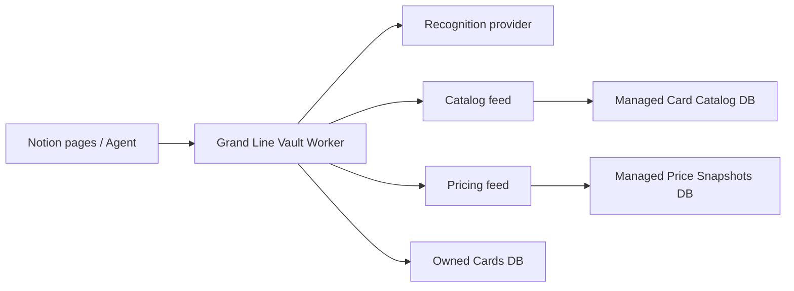

# Grand Line Vault

Grand Line Vault is a Notion-native One Piece Card Game collector for the Notion hackathon.

It is built around one simple loop:

```text
scan → recognize → enrich → store → explore
```

## What is included

- Notion Worker scaffold
- managed `Card Catalog` sync
- managed `Price Snapshots` sync
- card recognition tool with English-only auto-match rules
- owned-card creation tool
- collection summary and duplicate-detection tools
- pre-grade estimation helper
- workspace setup guide
- teammate-ready product spec

## Architecture



## Project layout

```text
src/
  config.ts
  index.ts
  lib/
  notion/
  providers/
docs/
tests/
```

## Setup

1. Install Node.js 22+.
2. Install dependencies with `npm install`.
3. Copy `.env.example` to `.env`.
4. Fill in:
   - `NOTION_API_TOKEN`
   - `OWNED_CARDS_DATA_SOURCE_ID`
   - `WISHLISTS_DATA_SOURCE_ID`
   - `GIBL_API_KEY`
   - `CATALOG_FEED_URL`
   - `PRICE_FEED_URL`
5. Create the workspace databases from [the setup guide](./docs/NOTION_WORKSPACE_SETUP.md).
6. Run:

```bash
npm test
npm run typecheck
npm run build
```

## Worker capabilities

### Syncs

- `syncCardCatalog`
- `syncPriceSnapshots`
- `syncOptcgCardCatalog`
- `syncOptcgPriceSnapshots`
- `syncOptcgMasterSet`

### Tools

- `identifyCard`
- `identifyAndEnrichCard`
- `getCardDetails`
- `getSetCards`
- `filterCatalogCards`
- `listAllSets`
- `summarizeMasterSet`
- `classifyRecognitionCandidates`
- `addOwnedCard`
- `summarizeCollection`
- `listDuplicateCards`

## Notes

- This repo intentionally treats automated grading as a **pre-grade estimate**, not an official PSA grade.
- Catalog and pricing feeds are configurable so the project can switch providers without changing the Notion model.
- The teammate-ready product spec lives in [GRAND_LINE_VAULT_SPEC.md](./GRAND_LINE_VAULT_SPEC.md).
