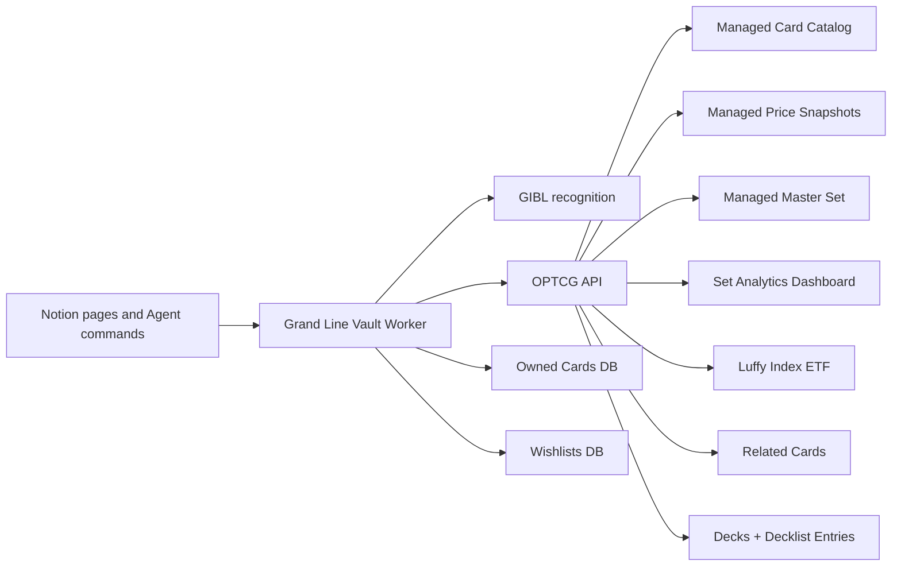

# Grand Line Vault

Grand Line Vault is a Notion-native One Piece Card Game collector built for the Notion hackathon. The product loop is intentionally simple:

```text
scan → recognize English card → enrich from OPTCG API → save owned copy → explore collection
```

Live workspace: [Grand Line Vault in Notion](https://www.notion.so/Grand-Line-Vault-3627be9e126e81bb83ced51cef2628b0)

## Features

### Scan and recognize
Upload a card photo to the Scan Inbox; the Worker calls a recognition provider (GIBL), classifies confidence + language, and only auto-matches English cards. Low-confidence and non-English scans land in a review queue rather than polluting the collection. Front-only scans work; front+back enables a richer pre-grade estimate.

### Enrich from OPTCG live data
On a confident match, the Worker pulls canonical card data from the OPTCG API (`getCardDetails`, `getSetCards`, `filterCatalogCards`, plus starter-deck / promo / DON variants) — name, set, rarity, color, type, cost, power, counter, attribute, art, market price. The same library powers offline demo mode using a bundled OP15-EB04 seed.

### Collection management
Each scan creates or updates an Owned Card row tied to the scanning user, with quantity, condition, pre-grade estimate, and acquisition price. Multi-user workspace: each crew member has their own collection while sharing the same canonical Card Catalog. Agent tools `addOwnedCard`, `summarizeCollection`, and `listDuplicateCards` cover the loop.

### Master-set tracking with progress bars
Every printing of every card — base, parallel, alt-art, promo — gets a row in the Master Set database. The Set Completion Dashboard rolls counts and market values per set. Toggle the `Completion %` column to "Show as bar" or "Show as ring" in Notion and every set lights up with a live progress visualization fed by your actual ownership.

### Portfolio and price snapshots
`syncOptcgPriceSnapshots` writes a daily snapshot per owned card. The Owned Cards board surfaces total estimated value, top holdings, and rarity rollups. Daily snapshots are the foundation for "what changed in my portfolio this week" once charting views are wired in.

### Card insights and recommendations
- **Related cards**: scoring engine that suggests the top-N most-related cards for any given card based on character, set, color identity, sub-types, cost curve, and rarity. Lives both as a managed `Related Cards` database (cached, gallery-browseable) and as an on-demand library call.
- **Luffy Index ETF**: a price-weighted index that treats every Monkey D. Luffy printing as a constituent of a fund. Track total fund value, top holdings, set distribution, and concentration risk per printing.
- **Collection summaries**: `summarizeCollection` gives totals, top holdings, color/rarity breakdowns per owner. `summarizeMasterSetCompletion` returns base/parallel/total ownership splits per set.
- **Agent-friendly**: every dataset is a Notion database, so a Custom Agent can answer "what cards am I missing from OP-05?", "what's my biggest Luffy holding?", "which duplicates could I trade?" in plain English.

### Deck building
Two related databases (`Decks` + `Decklist Entries`) plus a validator that checks OPTCG construction rules (1 Leader, 50 main, 10 DON!!, max 4 copies, color identity). Same rows render as a **card list** (table grouped by Slot) and as an **image gallery** in Notion — switch views, the data stays in sync.

### Image galleries
Every card-bearing database stores an image. A short [recipe](./docs/GALLERY_VIEWS.md) sets up consistent Gallery views across Card Catalog, Master Set, Luffy Index, Decklist Entries, and Owned Cards — instant card-wall browsing for any board.

### Pre-grade estimate
When a scan includes both front and back, `estimatePreGrade` returns a likely PSA range (8–9, 9–10, etc.) plus a confidence level based on centering / corners / edges / surface signals. Framed deliberately as **pre-grade**, never an official grade.

### Multi-provider price intelligence (in review)
PriceCharting integration (PRs #18 / #19) adds graded-card market prices (BGS 10, CGC 10, SGC 10) that OPTCG doesn't publish — useful for comparing "raw vs graded" outcomes on the same card.

### Pokemon TCG via TCGdex (in review)
A separate, namespaced section (PRs #13–#16) wraps the open [TCGdex](https://tcgdex.dev/) API for Pokemon cards, sets, series, and reference metadata. Kept strictly isolated from One Piece code so the workspace can evolve into a multi-game vault without mixing data models.

## Templates

The Worker provisions and populates a set of managed Notion databases that each act as a reusable template. Every one has gallery-friendly imagery or progress-bar-ready numeric columns so collectors can browse the way they prefer.

| Template | Database key | Defined in | What it tracks |
|---|---|---|---|
| **Card Catalog** | `cardCatalog` | `src/index.ts` | Canonical English card records — one row per unique variant |
| **Master Set** | `masterSet` | `src/notion/master-set-database.ts` | Every printing (base / parallel / alt-art / promo) per set with `Owned` checkbox |
| **Set Completion Dashboard** | `setAnalytics` | `src/notion/analytics-databases.ts` | Per-set summary with **`Completion %` progress bar**, base/parallel split, total + owned market value |
| **Rarity Breakdown** | `rarityAnalytics` | `src/notion/analytics-databases.ts` | Per-rarity counts and values (template; wire a sync to populate) |
| **Top Cards by Value** | `topCards` | `src/notion/analytics-databases.ts` | Most-valuable cards across the collection (template) |
| **Luffy Index ETF** | `luffyIndex` | `src/notion/luffy-index-database.ts` | Price-weighted index of every Luffy printing with **`Index Weight` progress bar** |
| **Decks** | `decks` | `src/notion/decks-database.ts` | One row per deck — Leader, Format, Status, Card Count, Estimated Value |
| **Decklist Entries** | `decklistEntries` | `src/notion/decklist-entries-database.ts` | Per-(deck, card) rows for the **card list + image gallery** dual view, with quantity and slot |
| **Related Cards** | `relatedCards` | `src/notion/related-cards-database.ts` | One row per (source, recommended) pair with score and colored reason chips |
| **Price Snapshots** | `priceSnapshots` | `src/index.ts` | Time-series price records per card; foundation for portfolio history |
| **Scan Inbox** | user-created | `docs/NOTION_WORKSPACE_SETUP.md` | Upload front/back images, see status, link to the matched owned card |
| **Owned Cards** | user-created | `docs/NOTION_WORKSPACE_SETUP.md` | The per-owner source of truth — quantity, condition, scan, pre-grade, current value |
| **Wishlists** | user-created | `docs/NOTION_WORKSPACE_SETUP.md` | Chase cards with priority and target price |

### Template guides

- [Master Set tracking](./docs/LUFFY_INDEX_ETF.md) — Luffy Index ETF deep-dive + methodology
- [Gallery views recipe](./docs/GALLERY_VIEWS.md) — how to flip any card database to image-first browsing
- [Decklist template](./docs/DECKLIST_TEMPLATE.md) — deck builder docs with recommended views (card list, image wall, cost curve, by color)
- [Related cards scoring](./docs/RELATED_CARDS.md) — scoring weights + wiring snippet + future enhancements
- [Notion workspace setup](./docs/NOTION_WORKSPACE_SETUP.md) — initial provisioning of the user-managed databases

## Current status

### Done

- Public GitHub repo and deployed Notion Worker.
- Notion command center with embedded collection, scan inbox, wishlist, and master-set views.
- Scan Inbox, Owned Cards, Wishlists, and Master Set databases.
- Gallery, set-completion, owner, duplicate, wishlist, and portfolio-style views in Notion.
- GIBL image-recognition integration for the scan path.
- Scan Inbox upload path: upload a `Front image`, then run `processScanInboxQueue` to recognize/enrich the card and create an owned-card record. The true `processScanInboxUpload` Notion automation is coded but gated until the workspace has Worker automations enabled.
- English-only recognition guardrails.
- OPTCG API card, set, starter-deck, promo, DON!!, price, and image-fetch helpers.
- Offline OP15-EB04 seed data for resilient demos when the live image/card API is unavailable.
- Managed syncs for card catalog, price snapshots, master set, and set analytics (ownership-aware completion %).
- Agent tools for lookup, enrichment, collection summaries, duplicate detection, and master-set completion.
- Decklist template with card-list + image-gallery views and OPTCG validator.
- Luffy Index ETF template with price weighting and concentration analytics.
- Related-cards scoring engine and managed `Related Cards` board.
- Seed scan test with OP13-118 Monkey.D.Luffy and OP13-119 Portgas.D.Ace.

### Still intentionally open

- True upload-trigger automation is blocked until Notion enables Worker automation capabilities for the workspace. Current fallback: upload image, keep Status = `New`, then run `processScanInboxQueue`.
- Portfolio history currently uses snapshots and collection fields; true gain/loss over time needs recurring price snapshots plus a charting view.
- Buying flow is P2 and should start as marketplace outbound links, not checkout.
- Rarity-breakdown and top-cards analytics templates exist but their syncs are not yet wired.

## Architecture



## Worker capabilities

### Syncs

- `syncCardCatalog` — generic configurable catalog feed.
- `syncPriceSnapshots` — generic configurable price feed.
- `syncOptcgCardCatalog` — OPTCG-backed OP set catalog.
- `syncOptcgPriceSnapshots` — OPTCG-backed price snapshots.
- `syncOptcgMasterSet` — OP master-set variants and metadata.
- `syncOptcgSetAnalytics` — set-level counts and total market value with ownership-aware completion %.

### Automations

- `processScanInboxUpload` — coded and gated behind `ENABLE_NOTION_AUTOMATIONS=1`; use when Worker automations are enabled for the workspace.

### Agent tools

- `identifyCard`
- `identifyAndEnrichCard`
- `processScanInboxPage`
- `processScanInboxQueue`
- `getCardDetails`
- `getSetCards`
- `filterCatalogCards`
- `listAllSets`
- `summarizeMasterSet`
- `classifyRecognitionCandidates`
- `addOwnedCard`
- `summarizeCollection`
- `listDuplicateCards`
- `listStarterDecks`
- `getStarterDeckCards`
- `getStarterCardDetails`
- `filterStarterCards`
- `listAllStarterCards`
- `getPromoCardDetails`
- `filterPromoCards`
- `listDonCards`

## Setup

1. Install Node.js 22+ and npm 10+.
2. Install dependencies:

```bash
npm install
```

3. Copy `.env.example` to `.env`.
4. Configure the required values:

```text
NOTION_API_TOKEN=
SCAN_INBOX_DATA_SOURCE_ID=
OWNED_CARDS_DATA_SOURCE_ID=
WISHLISTS_DATA_SOURCE_ID=
GIBL_API_KEY=
```

5. Optional values:

```text
GIBL_GAME_TYPE=one-piece
CATALOG_FEED_URL=
PRICE_FEED_URL=
OPTCG_SET_IDS=OP-01,OP-02,OP-03,OP-04,OP-05,OP-06,OP-07,EB-01,OP-08,OP-09,OP-10,OP-11,EB-02,OP-12,PRB-01,PRB-02,OP-13,OP14-EB04,EB-03,OP15-EB04
RECOGNITION_CONFIDENCE_THRESHOLD=0.82
ENABLE_NOTION_AUTOMATIONS=0
```

6. Create/share the Notion databases from [the setup guide](./docs/NOTION_WORKSPACE_SETUP.md).
7. Validate locally:

```bash
npm run typecheck
npm test
npm run build
```

## Repository layout

```text
src/
  config.ts                 Environment configuration
  index.ts                  Worker syncs and Agent tools
  data/                     Offline seed data for demo resilience
  lib/                      Collection, grading, master-set, analytics, decklist, related-cards, luffy-index logic
  notion/                   Notion database read/write helpers and schemas
  providers/                Recognition, generic feeds, OPTCG, TCGdex, and PriceCharting providers
docs/
  NOTION_WORKSPACE_SETUP.md   Initial workspace provisioning
  GALLERY_VIEWS.md            Image-gallery view recipes
  LUFFY_INDEX_ETF.md          Luffy Index ETF concept and methodology
  DECKLIST_TEMPLATE.md        Deck builder template walkthrough
  RELATED_CARDS.md            Related-cards scoring engine
GRAND_LINE_VAULT_SPEC.md      Product/team spec
CHANGELOG.md                  Release notes
```

## Product notes

- Automated grading is a **pre-grade estimate**, not an official PSA grade.
- English-only matching is deliberate for the P0 collection loop.
- Generic catalog/price feeds remain available, but the live One Piece path uses OPTCG API plus GIBL.
- Pokémon TCGdex work and PriceCharting integration are in review PRs and should not be auto-merged without an explicit product decision.
